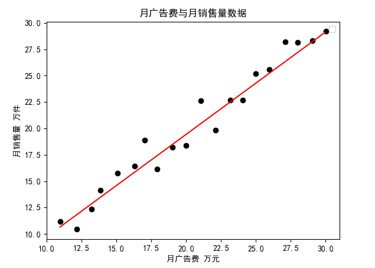

### 机器学习—线性回归


#### 一、某企业某商品月广告费用与月销售量数据如表所示， 试通过线性回归模型分析预测这两组数据之间的关系

##### 数据集

| 月份 | 月广告费 | 月销售量 |
| ---- | -------- | -------- |
| 1    | 10.95    | 11.18    |
| 2    | 12.14    | 10.43    |
| 3    | 13.22    | 12.36    |
| 4    | 13.87    | 14.15    |
| 5    | 15.06    | 15.73    |
| 6    | 16.30    | 16.40    |
| 7    | 17.01    | 18.86    |
| 8    | 17.93    | 16.13    |
| 9    | 19.01    | 18.21    |
| 10   | 20.01    | 18.37    |
| 11   | 21.04    | 22.61    |
| 12   | 22.10    | 19.83    |
| 13   | 23.17    | 22.67    |
| 14   | 24.07    | 22.70    |
| 15   | 25.00    | 25.16    |
| 16   | 25.95    | 25.55    |
| 17   | 27.10    | 28.21    |
| 18   | 28.01    | 28.12    |
| 19   | 29.06    | 28.32    |
| 20   | 30.05    | 29.18    |

##### 解答

计算误差
$$
l = \frac{1}{n}\sum_{i=1}^{n}(f(x_i) - y_i)^2, f(x_i) = w^Tx_i + b \\
$$


```python
def compute_error(w, b, points):
    total_error = 0.
    for i in range(len(points)):
        x = points[i, 0]
        y = points[i, 1]
        total_error += (w * x + b - y) ** 2
    return total_error / float(len(points))
```


逐步更新梯度
$$
\frac{\partial l}{\partial w} = \frac{2}{n}\sum_{i=1}^{n}(f(x_i) - y_i) * x_i \\\\
\frac{\partial l}{\partial b} = \frac{2}{n}\sum_{i=1}^{n}(f(x_i) - y_i) \\\\
w = w - lr * \bigtriangledown w = w - lr * \frac{\partial l}{\partial w}\mid_{x=x_i} \\\\
b = b - lr * \bigtriangledown b = b - lr * \frac{\partial l}{\partial b}\mid_{x=x_i} \\\\
$$


```python
def do_gradient(w, b, points, lr):
    w_grad = 0.
    b_grad = 0.
    N = float(len(points))

    for i in range(len(points)):
        x = points[i, 0]
        y = points[i, 1]
        w_grad = 2 * (w * x + b - y) * x / N
        b_grad = 2 * (w * x + b - y) / N
    new_w_grad = w - lr * w_grad
    new_b_grad = b - lr * b_grad
    return [new_w_grad, new_b_grad]
```


求解

```python

def run(w_init, b_init, points, lr, iter, error_limit):
    w_cur = w_init
    b_cur = b_init

    for i in range(iter):
        w_cur, b_cur = do_gradient(w_cur, b_cur, points, lr)
        error = compute_error(w_cur, b_cur, points)
        if error < error_limit:
            break
    return [w_cur, b_cur]

TITLE = '月广告费与月销售量数据'
XLABEL = '月广告费 万元'
YLABEL = '月销售量 万件'

dataset = np.genfromtxt('./data/data-1.csv', delimiter=',', encoding="utf-8")
x = dataset[:, 1][1:]
y = dataset[:, 2][1:]

f1 = plt.figure(1)
plt.title(TITLE)
plt.xlabel(XLABEL)
plt.ylabel(YLABEL)

plt.scatter(x, y, marker='o', color='k')
plt.legend(loc='upper right')

init_w = 0
init_b = 0

data_sets = np.array([x, y]).T


init_w, init_b = run(
    w_init=init_w,
    b_init=init_b,
    points=data_sets,
    lr=0.001,
    iter=1000,
    error_limit=0.5
)

print(init_w, init_b)

r_x = np.arange(np.min(x), np.max(x))
r_y = init_w * r_x + init_b

plt.plot(r_x, r_y, color='r')

plt.show()
```



得到`w`和`b`的值分别为：`0.9699740874610406`和 `0.03227867179570855`


#### 二、编程实现对率回归，并给出下面西瓜数据集上的结果。

##### 数据集
| 编号 | 密度  | 含糖率 | 好瓜 |
| ---- | ----- | ------ | ---- |
| 1    | 0.697 | 0.46   | 1    |
| 2    | 0.774 | 0.376  | 1    |
| 3    | 0.634 | 0.264  | 1    |
| 4    | 0.608 | 0.318  | 1    |
| 5    | 0.556 | 0.215  | 1    |
| 6    | 0.403 | 0.237  | 1    |
| 7    | 0.481 | 0.149  | 1    |
| 8    | 0.437 | 0.211  | 1    |
| 9    | 0.666 | 0.091  | 0    |
| 10   | 0.243 | 0.0267 | 0    |
| 11   | 0.245 | 0.057  | 0    |
| 12   | 0.343 | 0.099  | 0    |
| 13   | 0.639 | 0.161  | 0    |
| 14   | 0.657 | 0.198  | 0    |
| 15   | 0.36  | 0.37   | 0    |
| 16   | 0.593 | 0.042  | 0    |
| 17   | 0.719 | 0.103  | 0    |


